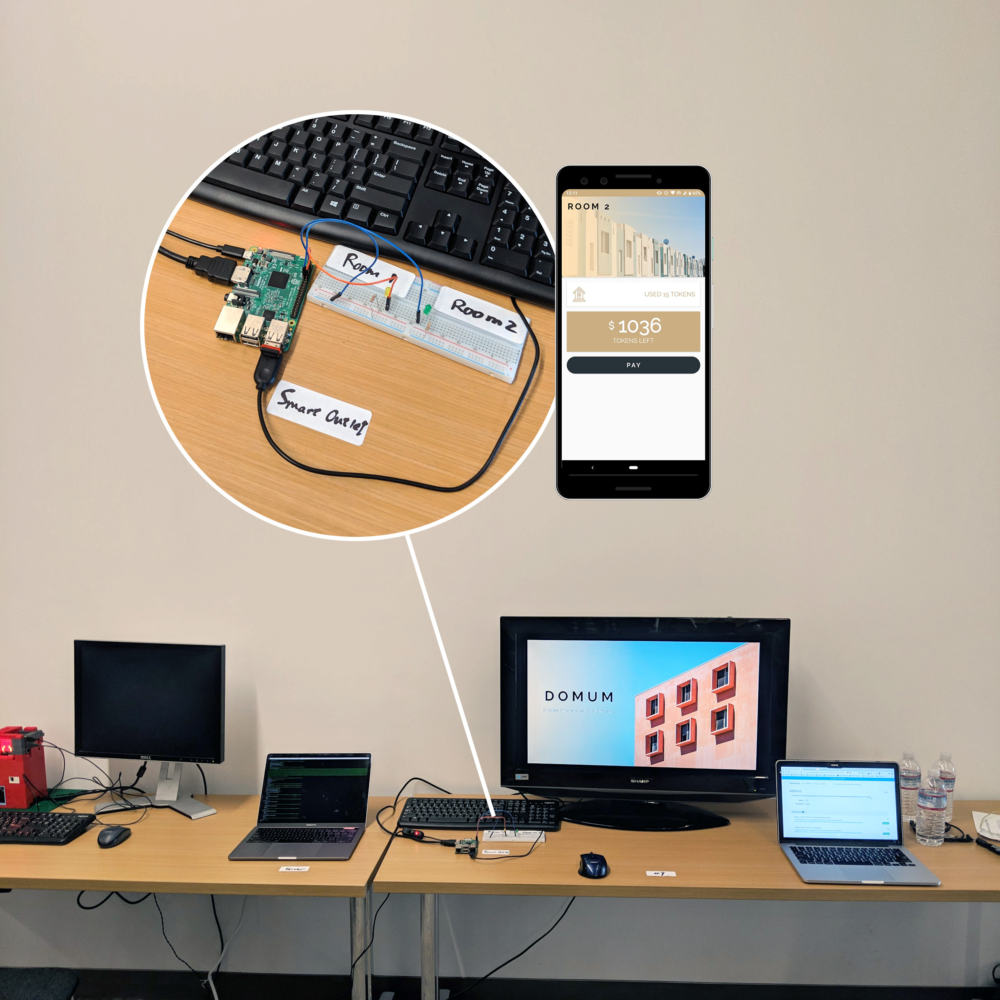

# Domum

*Enables smarter lives for apartments*

Domum is an IOTA-connected IoT (Internet of Things) system that helps shared apartment residents to fairly and trustlessly pay for their utilities. **[Domum won First Place in Blockathon@USC 2019.](https://devpost.com/software/domum-c83puo)**

## Inspiration
As the current generation leaning towards sharing economy, we like to share apartment space with other people, especially with strangers. This sharing economy raised much concern in building management and utility fee sharing between each resident in one apartment having one account for electricity, Wi-Fi and gas. Residents need to have basic trust with each other to regulate the payment and have not intentionally consume too much to disbenefit, other people.

## What it does
The system gives a demonstration on a future blockchain application on smart building management geared towards sharing economy apartments for residents. Domum used the raspberry pi to set up a smart IoT outlet device put at the apartment’s power supply box. It accurately checks for the amount left in the users' wallet and measures the usage of electricity for each room. We then used the IOTA blockchain for trustless and feeless micropayments for each residents' consumption and make sure the consumption data is valid and unaltered. On the user end, the experience is the same as using an app.

## How we built it
Blockchain Development The whole system is currently semi-decentralized. With a MongoDB server running to manage user experience and offloading some computational and storage need for the IOTA blockchain. IOTA handles the micropayment and each transaction could be completed and confirmed in mins as well as making sure the data integrity. For the data integrity, the semi-decentralized system will not have any compromise in data in integrity and decentralization for verification because the hash value of each transaction in the MongoDB server is stored to IOTA network.

App and IoT device The Android user app is powered by the MongoDB to enable a smooth experience. The Domum IoT device is developed with Raspberry Pi to demonstrate consumption for 2 rooms.

## Accomplishments that we're proud of
Learning the IOTA blockchain and its development for the first time.

## What we learned
Blockchain can be fun!!! We really need to think about the real use case for the technology and focus on its advantages as a semi-distributed and fully distributed system.

## What's next for Domum
We right now want to expand to other utilities than electricity, and then eventually build the future of smart building sharing economy.

## Built With
* IOTA
* Raspberry-Pi
* Node.js
* MongoDB
* Android
* Kotlin

## Team

* [Alex Fan](https://github.com/alexfanchina)
* [Kaushal Saraf](https://github.com/Kaushalop)
* [Ling Ye](https://github.com/YeLing7)
* [Wei Wang](https://github.com/tianshanghong)
* [Zexing Jiang](https://github.com/eligah)
